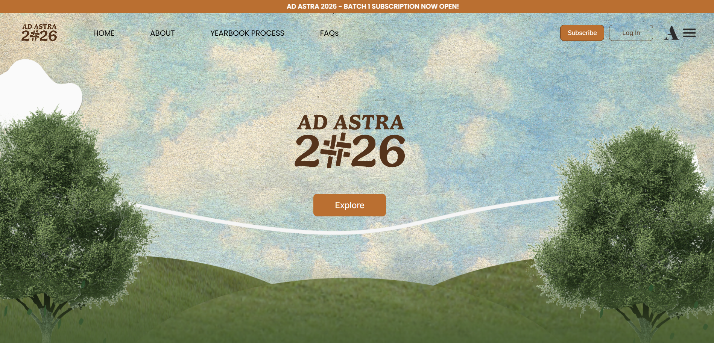

# AD ASTRA 2026

Assigned sections in the AD ASTRA 2026 Website development for graduating students of A.Y. 2025-2026.

**DATE LAUNCHED**: May 29, 2025

## Project Overview

This contains my assigned sections and informational pages for AA2026 subscription website. It includes user agreements on privacy policy notice, terms and conditions, and assets.

## Pages

- **How to Subscribe** (`hts.html`) - Step-by-step subscription guide
- **Subscribe Now** (`subnow.html`) - Banner button
- **Terms and Conditions** (`terms.html`) - Event terms and conditions
- **Agreement** (`agreement.html`) - Privacy Policy Notice

## Project Structure

```
[LUDS]-AA2026/
├── HTML Files
│   ├── hts.html          - How to Subscribe section
│   ├── subnow.html       - Subscribe Now banner
│   ├── terms.html        - Terms and Conditions page
│   └── agreement.html    - Privacy Policy Notice page
│
├── CSS Files
│   ├── global.css        - Global styles
│   ├── hts.css           - How to Subscribe styles
│   ├── subnow.css        - Subscribe Now styles
│   ├── terms.css         - Terms and Conditions styles
│   └── agreement.css     - Privacy Policy Notice styles
│
├── JavaScript
│   └── script.js         - Functionality
│
├── Assets
│   └── assets/           - Images + assets
│       ├── Background images (desktop and mobile)
│       ├── Bottom assets and decorative elements
│       └── Step indicators and visual guides
│
├── Fonts
│   └── fonts/
│       ├── Bilo family  - Primary typeface
│       └── Gelica family - Secondary typeface
│
└── Additional
    ├── special-req/     - Special request backgrounds
    ├── unused/          - Archived files
    └── notes.txt        - Development notes
```

## Technologies Used

- HTML5
- CSS3
- JavaScript (Vanilla)
- Custom fonts (Bilo, Gelica)

## Design Features

- Responsive design for desktop and mobile
- Custom typography with Bilo and Gelica fonts
- Step-by-step registration process
- Embedded Google Docs integration for terms
- Custom background assets and visual elements

## Repository

GitHub: [https://github.com/ludreinsalvador/ad-astra-2026.git](https://github.com/ludreinsalvador/ad-astra-2026.git)

## License

All rights reserved.